# Mermaid Visualization Syntax for Project Plans

Reference for creating project plan visualizations using Mermaid diagrams.
Focus on Gantt charts, timelines, and burndown/burnup charts commonly used in project management.

---

## Gantt Chart Syntax

Gantt charts display project schedule with tasks, milestones, and dependencies.

### Basic Structure

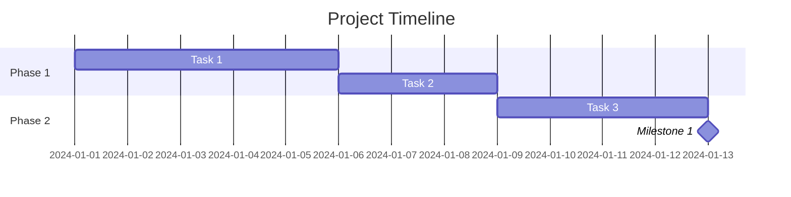

### Date Configuration

- **dateFormat**: Input date format (default: YYYY-MM-DD)
  - Supported formats: YYYY, YY, Q1-4, MM, MMM, MMMM, D, DD, Do, DDD, DDDD, X (Unix timestamp), x (Unix ms), H, HH, h, hh, m, mm, s, ss, S, SS, SSS, Z, ZZ

- **axisFormat**: Display format on timeline axis (default: %Y-%m-%d)
  - %Y: Year with century
  - %m: Month (01-12)
  - %d: Day of month (01-31)
  - %H: Hour (00-23)
  - %M: Minute (00-59)

Example:
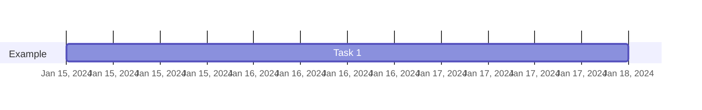

### Task Definitions

#### Basic Task
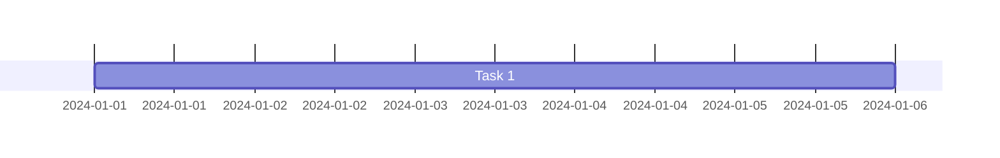

#### Task with ID


#### Sequential Tasks (Default)
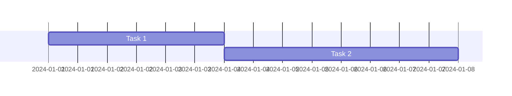

#### Multiple Dependencies
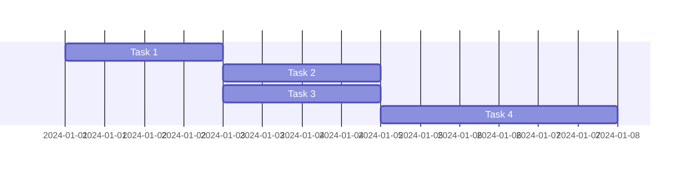

#### Specific Start Date
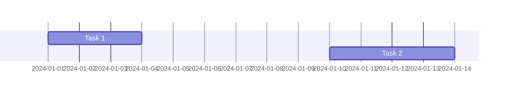

#### Until Another Task
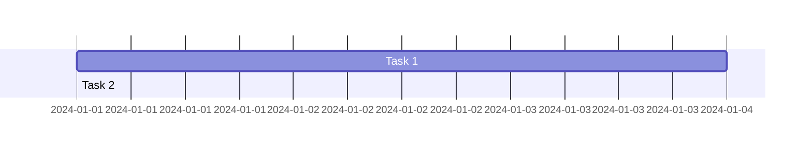

### Task Status Tags

#### Active Task
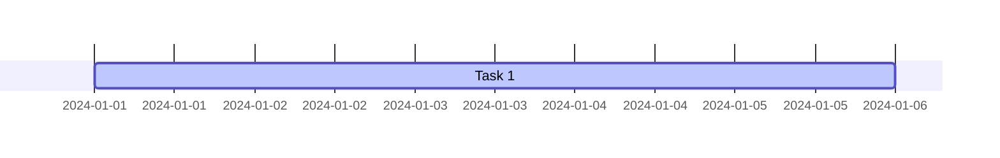

#### Completed Task
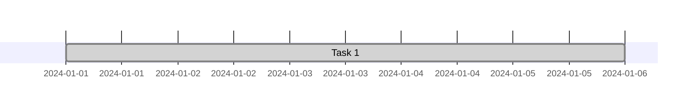

#### Critical Path
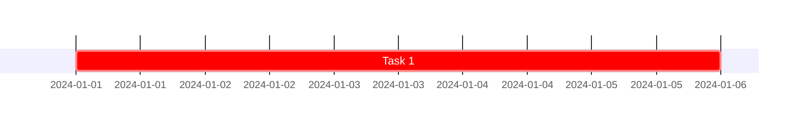

#### Milestone
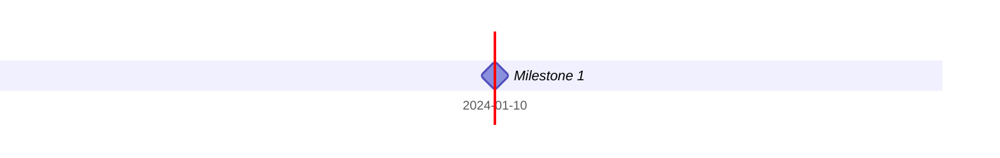

#### Combined Tags
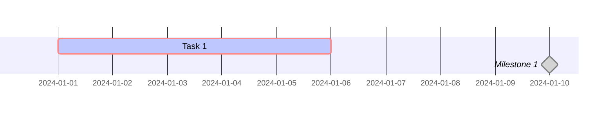

### Sections

Organize tasks into logical sections or phases:

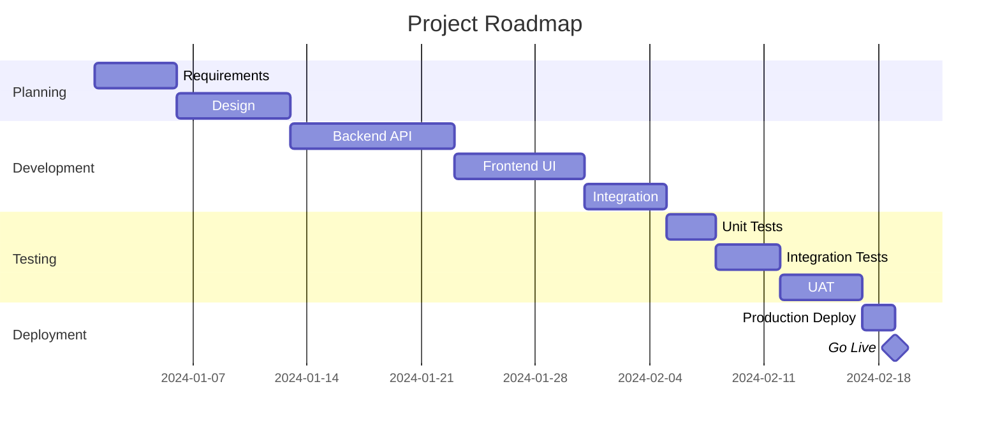

### Exclusions

Define non-working days or periods:

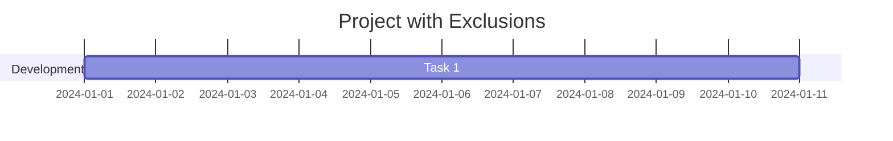

#### Exclude Weekends
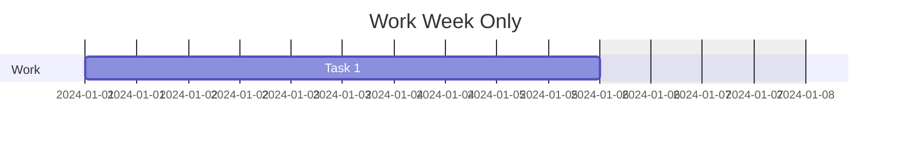

#### Define Weekend Days
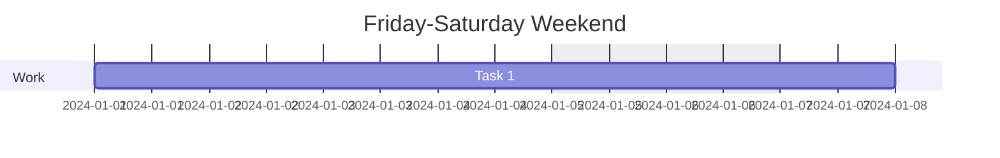

### Compact Mode

Display multiple tasks in same row:

```mermaid
gantt
    title Compact View
    dateFormat YYYY-MM-DD
    displayMode compact

    section Phase 1
    Task 1           :2024-01-01, 2d
    Task 2           :2024-01-03, 2d
    Task 3           :2024-01-05, 2d
```

### Vertical Markers

Add vertical lines for important dates:

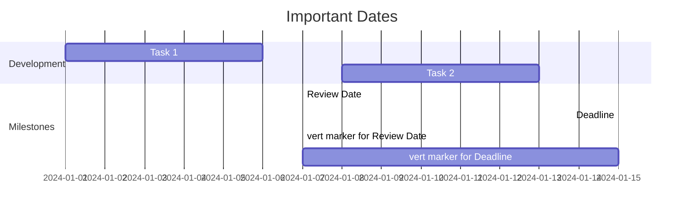

### Configuration Options

```javascript
mermaid.ganttConfig = {
  titleTopMargin: 25,        // Margin above title
  barHeight: 20,             // Height of task bars
  barGap: 4,                 // Gap between bars
  topPadding: 75,             // Padding below title
  rightPadding: 75,            // Padding for section names
  leftPadding: 75,             // Padding for section names
  gridLineStartPadding: 10,    // Vertical grid line position
  fontSize: 12,                // Font size
  sectionFontSize: 24,          // Section font size
  numberSectionStyles: 1,        // Alternating section styles
  axisFormat: '%Y-%m-%d',      // Axis date format
  tickInterval: '1week',        // Axis tick interval
  topAxis: true,               // Show dates on top
  displayMode: 'compact',       // Compact mode
  weekday: 'sunday'           // Week start day
};
```

---

## Timeline Syntax

Timeline for high-level project phases and milestones:

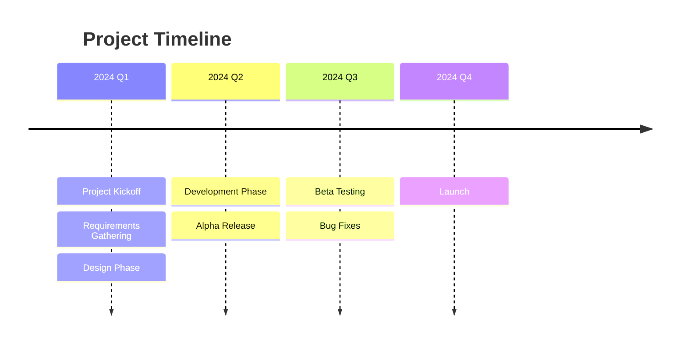

Detailed timeline:
```mermaid
timeline
    title Development Roadmap
    section Planning
      Jan 2024 : Kickoff Meeting
      Feb 2024 : Requirements Complete
      Mar 2024 : Design Signoff
    section Development
      Apr 2024 : Sprint 1
      May 2024 : Sprint 2
      Jun 2024 : Sprint 3
    section Testing
      Jul 2024 : Internal Testing
      Aug 2024 : User Acceptance Testing
    section Launch
      Sep 2024 : Production Deployment
```

---

## XY Chart for Burndown/Burnup

### Burndown Chart

Remaining work over time:

```mermaid
xychart-beta
    title "Sprint Burndown"
    x-axis ["Day 1", "Day 2", "Day 3", "Day 4", "Day 5"]
    y-axis "Story Points" 0 --> 40
    line [30, 25, 20, 15, 5]
```

Burndown with ideal line:
```mermaid
xychart-beta
    title "Sprint Burndown"
    x-axis ["Day 1", "Day 2", "Day 3", "Day 4", "Day 5"]
    y-axis "Story Points" 0 --> 30
    line [30, 22.5, 15, 7.5, 0]
    line [30, 24, 20, 12, 5]
```

### Burnup Chart

Completed work and scope:

```mermaid
xychart-beta
    title "Project Burnup"
    x-axis ["Week 1", "Week 2", "Week 3", "Week 4"]
    y-axis "Story Points" 0 --> 100
    line [20, 45, 70, 85]
    line [100, 100, 110, 110]
```

### Velocity Tracking

Team velocity over sprints:

```mermaid
xychart-beta
    title "Team Velocity"
    x-axis ["Sprint 1", "Sprint 2", "Sprint 3", "Sprint 4"]
    y-axis "Story Points" 0 --> 60
    line [45, 52, 48, 55]
```

---

## Best Practices for Project Plans

### Gantt Chart Guidelines

1. **Use clear, descriptive task names**
   - ✅ "Design User Authentication API"
   - ❌ "Auth API" or "Task 1"

2. **Break down large tasks**
   - Tasks should be 1-10 days each
   - If task is > 2 weeks, break it down

3. **Use milestones for key deliveries**
   - Zero-duration tasks (0d)
   - Mark phase completions, releases, reviews

4. **Show dependencies clearly**
   - Use `after taskID` for sequential work
   - Use multiple dependencies: `after task1 task2 task3`

5. **Use sections to organize**
   - Group by phase, team, or work stream
   - Makes chart easier to read

6. **Mark critical path**
   - Use `crit` tag for tasks on critical path
   - Helps identify schedule risks

7. **Track progress**
   - Use `active` for work in progress
   - Use `done` for completed work

### Burndown Chart Guidelines

1. **Update daily**
   - Plot remaining story points each day
   - Shows real progress vs. ideal

2. **Include ideal line**
   - Linear burndown from start to finish
   - Helps identify if team is ahead/behind

3. **Track cumulative flow**
   - Separate lines for each status
   - Shows work distribution across states

### Timeline Guidelines

1. **Keep it high-level**
   - Use for phases, milestones, releases
   - Don't include individual tasks

2. **Align with stakeholder communication**
   - External stakeholders: timeline view
   - Internal team: detailed Gantt

3. **Show key dates**
   - Launch dates, review milestones, decision points

---

## Common Project Management Visualizations

### Release Planning
```mermaid
gantt
    title Release Roadmap 2024
    dateFormat YYYY-MM-DD
    axisFormat %b %Y

    section Q1
    v1.0 Release        :milestone, 2024-03-31, 0d
    Core Features        :2024-01-15, 60d

    section Q2
    v1.1 Release        :milestone, 2024-06-30, 0d
    Enhancements         :2024-04-15, 60d

    section Q3
    v2.0 Release        :milestone, 2024-09-30, 0d
    Major Update         :2024-07-15, 60d
```

### Sprint Tracking
```mermaid
gantt
    title Sprint 3
    dateFormat YYYY-MM-DD
    excludes weekends

    section Backend
    API Integration    :a1, 2024-01-15, 3d
    Data Migration     :a2, after a1, 2d

    section Frontend
    UI Components      :b1, 2024-01-15, 4d
    User Stories       :b2, after b1, 3d

    section QA
    Testing           :c1, after a2 b2, 2d
    Bug Fixes         :c2, after c1, 1d

    section Milestone
    Sprint End        :milestone, 2024-01-26, 0d
```

### Cross-Team Coordination
```mermaid
gantt
    title Cross-Team Dependencies
    dateFormat YYYY-MM-DD

    section Backend Team
    Service API       :back1, 2024-01-01, 7d
    Database Schema    :back2, 2024-01-05, 5d

    section Frontend Team
    UI Wireframes     :front1, 2024-01-01, 5d
    Component Dev      :front2, after front1, 7d

    section DevOps Team
    CI/CD Pipeline    :ops1, 2024-01-03, 4d
    Deployment Prep    :ops2, 2024-01-10, 3d

    section Integration
    API Integration   :int1, after back1 front2, 5d
    E2E Testing       :int2, after int1 ops2, 3d
```

### Risk Timeline
```mermaid
gantt
    title Risk Mitigation Timeline
    dateFormat YYYY-MM-DD

    section Critical Risks
    Performance Issue   :crit, r1, 2024-01-01, 10d
    Security Audit     :crit, r2, 2024-01-05, 7d

    section Mitigation
    Cache Layer        :m1, after r1, 5d
    Security Fixes     :m2, after r2, 3d

    section Validation
    Load Testing       :v1, after m1, 3d
    Penetration Test   :v2, after m2, 3d
```
