# Mermaid Visualization Syntax for Project Plans

Reference for creating project plan visualizations using Mermaid diagrams.
Focus on Gantt charts, timelines, and burndown/burnup charts commonly used in project management.

## Critical Updates (January 2026)

This documentation has been updated to reflect lessons learned from creating real project plans. Key changes:

### Gantt Charts
- **✅ Every task MUST have a unique ID** for dependencies to work correctly
- **✅ Single-developer projects require explicit sequential dependencies** using unique task IDs
- See "Common Mistakes to Avoid" and "Project Plan Specific Considerations" for details

### Burndown Charts
- **✅ Choose appropriate granularity** - Use milestone-level for project plans, daily/weekly for sprints
- **✅ NEVER use flat actual lines** that extend current state across all milestones/sprints
- **✅ Actual line shows only completed progress** - don't project or forecast
- **✅ Track progress in the unit that fits your project** - hours, tasks, or story points are all valid
- See "Project Plan Specific Considerations" for detailed examples

---

## Gantt Chart Syntax

Gantt charts display project schedule with tasks, milestones, and dependencies.

### Basic Structure

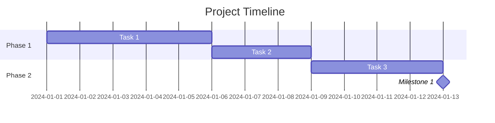

### Date Configuration

- **dateFormat**: Input date format (default: YYYY-MM-DD)
  - Supported formats: YYYY, YY, Q1-4, MM, MMM, MMMM, D, DD, Do, DDD, DDDD, X (Unix timestamp), x (Unix ms), H, HH, h, hh, m, mm, s, ss, S, SS, SSS, Z, ZZ

- **axisFormat**: Display format on timeline axis (default: %Y-%m-%d)
  - %Y: Year with century
  - %m: Month (01-12)
  - %d: Day of month (01-31)
  - %H: Hour (00-23)
  - %M: Minute (00-59)

Example:
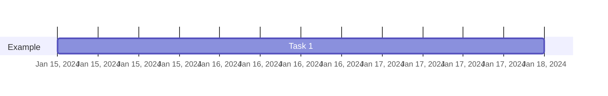

### Task Definitions

#### Basic Task
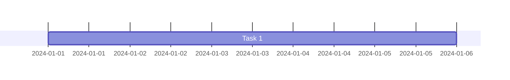

#### Task with ID


#### Sequential Tasks (Default)
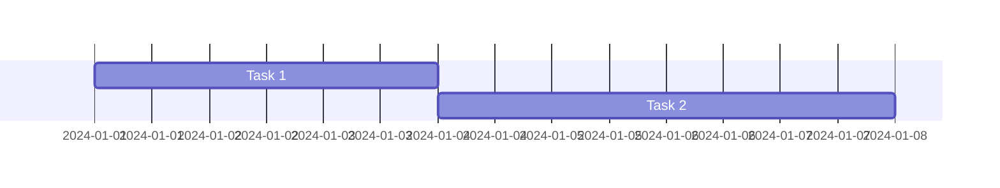

#### Multiple Dependencies
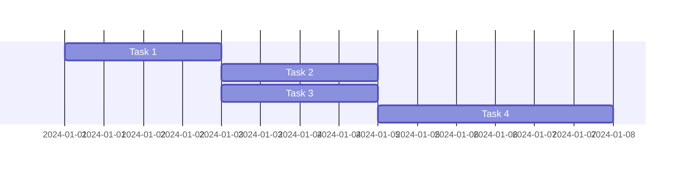

#### Specific Start Date
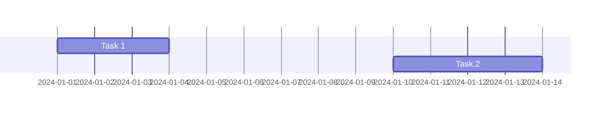

#### Until Another Task
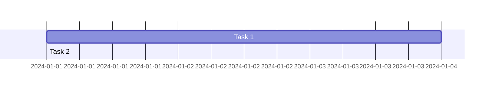

### Task Status Tags

#### Active Task
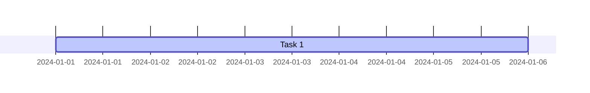

#### Completed Task
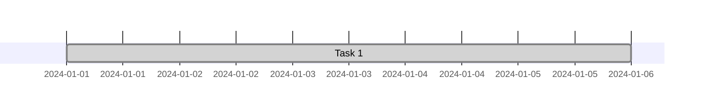

#### Critical Path
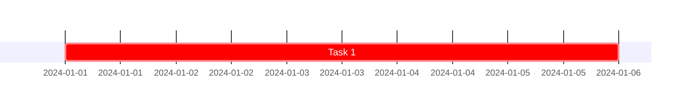

#### Milestone
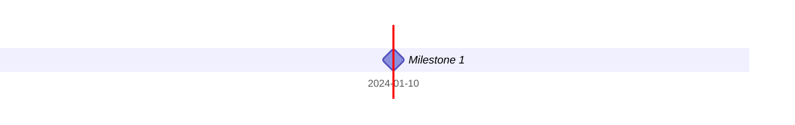

#### Combined Tags
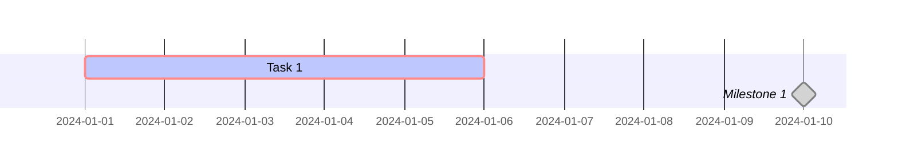

### Sections

Organize tasks into logical sections or phases:

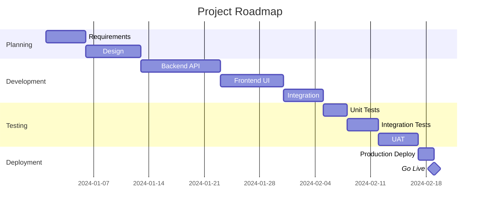

### Exclusions

Define non-working days or periods:

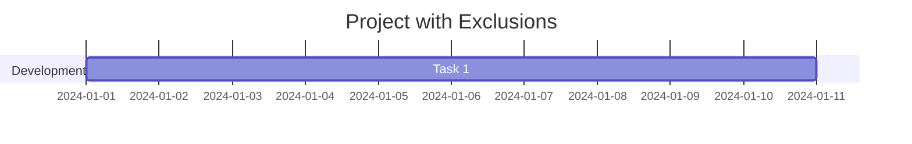

#### Exclude Weekends
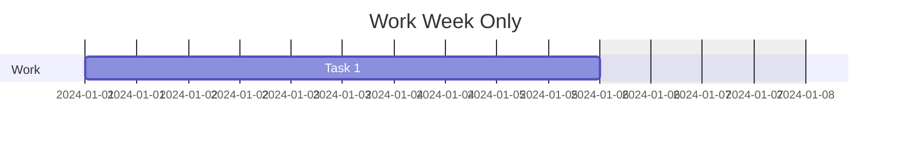

#### Define Weekend Days
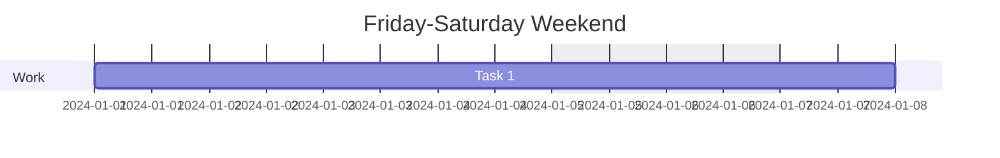

### Compact Mode

Display multiple tasks in same row:

```mermaid
gantt
    title Compact View
    dateFormat YYYY-MM-DD
    displayMode compact

    section Phase 1
    Task 1           :2024-01-01, 2d
    Task 2           :2024-01-03, 2d
    Task 3           :2024-01-05, 2d
```

### Vertical Markers

Add vertical lines for important dates:

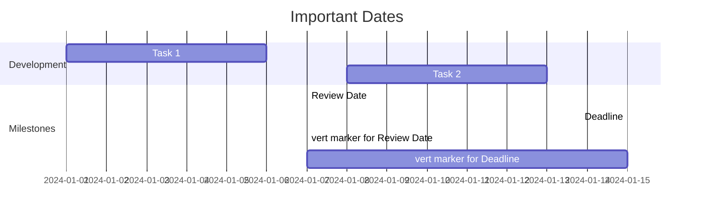

### Configuration Options

```javascript
mermaid.ganttConfig = {
  titleTopMargin: 25,        // Margin above title
  barHeight: 20,             // Height of task bars
  barGap: 4,                 // Gap between bars
  topPadding: 75,             // Padding below title
  rightPadding: 75,            // Padding for section names
  leftPadding: 75,             // Padding for section names
  gridLineStartPadding: 10,    // Vertical grid line position
  fontSize: 12,                // Font size
  sectionFontSize: 24,          // Section font size
  numberSectionStyles: 1,        // Alternating section styles
  axisFormat: '%Y-%m-%d',      // Axis date format
  tickInterval: '1week',        // Axis tick interval
  topAxis: true,               // Show dates on top
  displayMode: 'compact',       // Compact mode
  weekday: 'sunday'           // Week start day
};
```

---

## Timeline Syntax

Timeline for high-level project phases and milestones:

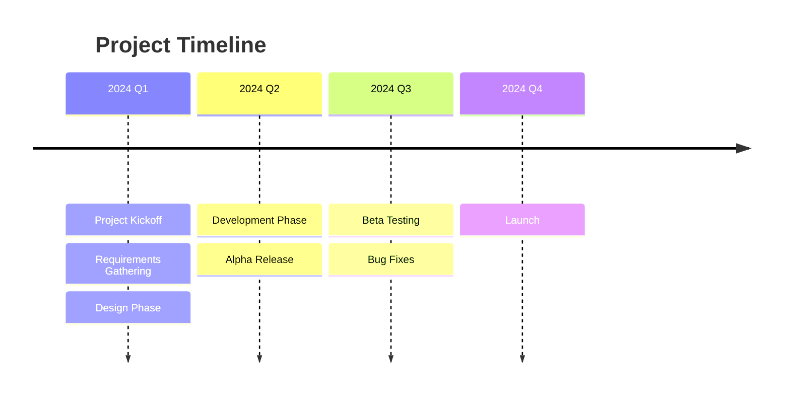

Detailed timeline:
```mermaid
timeline
    title Development Roadmap
    section Planning
      Jan 2024 : Kickoff Meeting
      Feb 2024 : Requirements Complete
      Mar 2024 : Design Signoff
    section Development
      Apr 2024 : Sprint 1
      May 2024 : Sprint 2
      Jun 2024 : Sprint 3
    section Testing
      Jul 2024 : Internal Testing
      Aug 2024 : User Acceptance Testing
    section Launch
      Sep 2024 : Production Deployment
```

---

## XY Chart for Burndown/Burnup

### Burndown Chart

**Daily Sprint Burndown:**

Remaining work over time (for individual sprints):

```mermaid
xychart-beta
    title "Sprint Burndown"
    x-axis ["Day 1", "Day 2", "Day 3", "Day 4", "Day 5"]
    y-axis "Story Points" 0 --> 40
    line [30, 25, 20, 15, 5]
```

**Daily Sprint Burndown with ideal line:**
```mermaid
xychart-beta
    title "Sprint Burndown"
    x-axis ["Day 1", "Day 2", "Day 3", "Day 4", "Day 5"]
    y-axis "Story Points" 0 --> 30
    line [30, 22.5, 15, 7.5, 0]
    line [30, 24, 20, 12, 5]
```

**Project-Level Burndown (Milestone Granularity):**

For project plans, track work units at milestone level. Choose your unit based on project methodology:

**Hours:**
```mermaid
xychart-beta
    title "Project Burndown (Hours)"
    x-axis "Milestones" [0, 1, 2, 3, 4, 5, 6, 7, 8, 9, 10, 11, 12, 13, 14, 15, 16]
    y-axis "Remaining Hours" 0 --> 330
    line [330, 316, 278, 246, 224, 208, 182, 160, 128, 118, 90, 72, 40, 20, 0, 0, 0]
    line [330, 316]
```

**Tasks:**
```mermaid
xychart-beta
    title "Project Burndown (Tasks)"
    x-axis "Milestones" [0, 1, 2, 3, 4, 5, 6, 7, 8, 9, 10, 11, 12, 13, 14, 15, 16]
    y-axis "Remaining Tasks" 0 --> 65
    line [65, 62, 55, 49, 44, 41, 36, 32, 26, 24, 18, 15, 8, 4, 0, 0, 0]
    line [65, 62]
```

**Story Points:**
```mermaid
xychart-beta
    title "Project Burndown (Story Points)"
    x-axis "Milestones" [0, 1, 2, 3, 4, 5, 6, 7, 8, 9, 10, 11, 12, 13, 14, 15, 16]
    y-axis "Remaining Story Points" 0 --> 200
    line [200, 190, 170, 150, 135, 125, 110, 95, 80, 72, 55, 45, 25, 12, 0, 0, 0]
    line [200, 190]
```

Key points:
- First line: Ideal burndown (linear from total to zero across all milestones)
- Second line: Actual progress (only completed milestones - current state at milestone 1)
- Choose unit that matches your planning methodology (hours, tasks, or story points)
- X-axis uses milestone numbers (0 = project start)

### Burnup Chart

Completed work and scope:

```mermaid
xychart-beta
    title "Project Burnup"
    x-axis ["Week 1", "Week 2", "Week 3", "Week 4"]
    y-axis "Story Points" 0 --> 100
    line [20, 45, 70, 85]
    line [100, 100, 110, 110]
```

### Velocity Tracking

Team velocity over sprints:

```mermaid
xychart-beta
    title "Team Velocity"
    x-axis ["Sprint 1", "Sprint 2", "Sprint 3", "Sprint 4"]
    y-axis "Story Points" 0 --> 60
    line [45, 52, 48, 55]
```

---

## Common Mistakes to Avoid

### Gantt Chart Mistakes

**1. Missing unique task IDs**
   ❌ WRONG:
   ```mermaid
   gantt
       dateFormat YYYY-MM-DD
       Task 1 :2024-01-01, 3d
       Task 2 :after Task 1, 3d
   ```
   This won't work correctly - "after Task 1" doesn't reference an ID.

   ✅ CORRECT:
   ```mermaid
   gantt
       dateFormat YYYY-MM-DD
       Task 1 :t1, 2024-01-01, 3d
       Task 2 :t2, after t1, 3d
   ```

**2. Ambiguous or non-unique task names**
   ❌ WRONG: Multiple tasks named "API Task" or "Task 1"
   ✅ CORRECT: Descriptive, unique names with unique IDs

**3. Missing dependencies in single-developer projects**
   Without explicit `after` dependencies with unique IDs, parallel execution may be assumed, which is incorrect for one person.

### Burndown Chart Mistakes

**1. Flat actual lines across all milestones/sprints**
   ❌ WRONG:
   ```mermaid
   xychart-beta
       x-axis "Milestones" [0, 1, 2, 3, 4, 5]
       y-axis "Remaining Work" 0 --> 200
       line [200, 160, 120, 80, 40, 0]
       line [200, 160, 160, 160, 160, 160]
   ```
   This makes it look like the project is stalled.

   ✅ CORRECT:
   ```mermaid
   xychart-beta
       x-axis "Milestones" [0, 1, 2, 3, 4, 5]
       y-axis "Remaining Work" 0 --> 200
       line [200, 160, 120, 80, 40, 0]
       line [200, 160]
   ```
   Actual line only shows completed progress.

**2. Inappropriate granularity**
   ❌ Daily burndown for multi-month project plan (too much data)
   ✅ Milestone-level burndown for project plans (appropriate scale)
   ✅ Daily burndown for individual sprints (appropriate scale)

**3. Mixing units or changing units mid-project**
   ❌ Starting with tasks, then switching to hours or story points
   ✅ Choose your unit (hours, tasks, or story points) and stick with it throughout the project

**4. Missing context for actual progress**
   Don't just show the chart. Explain:
   - Current milestone
   - Work completed (in your chosen unit)
   - What's coming next

**5. Forecast lines**
   Burndown charts show historical data, not future predictions. Don't include speculative data points.

---

## Best Practices for Project Plans

### Gantt Chart Guidelines

1. **Use clear, descriptive task names**
    - ✅ "Design User Authentication API"
    - ❌ "Auth API" or "Task 1"

2. **Break down large tasks**
    - Tasks should be 1-10 days each
    - If task is > 2 weeks, break it down

3. **Use milestones for key deliveries**
    - Zero-duration tasks (0d)
    - Mark phase completions, releases, reviews

4. **Show dependencies clearly**
    - Use `after taskID` for sequential work
    - Use multiple dependencies: `after task1 task2 task3`

5. **Use sections to organize**
    - Group by phase, team, or work stream
    - Makes chart easier to read

6. **Mark critical path**
    - Use `crit` tag for tasks on critical path
    - Helps identify schedule risks

7. **Track progress**
    - Use `active` for work in progress
    - Use `done` for completed work

8. **Always use unique task IDs**
    - Every task and milestone must have a unique ID
    - Required for proper dependency chains
    - Example: `taskID` pattern in task definitions
    - Without unique IDs, dependencies cannot be tracked accurately

9. **Ensure proper sequential execution**
    - Each task that depends on another must explicitly reference the previous task's ID
    - Use `:taskID, after previousTaskID` syntax
    - Critical for single-developer or constrained-resource projects

### Burndown Chart Guidelines

1. **Choose appropriate granularity**
    - **Sprint-level**: Plot remaining work units at sprint boundaries
   - **Milestone-level**: Plot remaining work units at each milestone (recommended for project plans)
    - **Daily**: Too granular for high-level project plans; reserve for sprint tracking

2. **Choose appropriate unit for tracking**
    - **Hours**: Good for detailed time-tracking projects, normalizes task complexity
    - **Tasks**: Simple and direct, works well when tasks have similar complexity
    - **Story Points**: Best for Agile/Scrum teams using velocity-based planning
    - Pick the unit that matches your project's planning methodology and stick with it
    - Always document the total being tracked (e.g., "330 total hours", "65 tasks", "200 story points")

3. **Define X-axis clearly**
    - Use milestone numbers (0, 1, 2, 3...) for project-level burndowns
    - Use days/weeks for sprint-level burndowns
    - Clearly label the X-axis to avoid confusion

4. **Avoid flat or projection lines**
    - **Flat actual lines**: Do not draw a line that extends the current state across all milestones/sprints. This creates a misleading impression of stalled progress.
    - **Projection lines**: Burndown charts show historical data, not forecasts. Do not project future completion.

5. **Show only historical actual progress**
    - Actual progress line should only include completed milestones
    - Example: If currently at Milestone 1, actual line should have two points (Milestone 0 and Milestone 1)
    - Use separate text/narration to explain current status and what's next

6. **Include ideal line**
    - Linear burndown from start to finish
    - Helps identify if team is ahead/behind

### Timeline Guidelines

1. **Keep it high-level**
    - Use for phases, milestones, releases
    - Don't include individual tasks

2. **Align with stakeholder communication**
    - External stakeholders: timeline view
    - Internal team: detailed Gantt

3. **Show key dates**
    - Launch dates, review milestones, decision points

---

## Project Plan Specific Considerations

### Gantt Charts for Project Plans

**Critical Issue: Unique Task IDs and Sequential Dependencies**

When creating Gantt charts for project plans (especially for single-developer or constrained-resource projects):

1. **Every task MUST have a unique ID**
   ```mermaid
   gantt
       dateFormat YYYY-MM-DD
       
       section Sprint 1
       Task 1 :t1, 2024-01-01, 3d
       Task 2 :t2, after t1, 3d
       Task 3 :t3, after t2, 4d
   ```
   Without unique IDs (like `:t1`, `:t2`), dependencies using `after` will not work correctly.

2. **Dependencies must reference previous task IDs**
   ```mermaid
   gantt
       dateFormat YYYY-MM-DD
       
       section Development
       Setup            :setup, 2024-01-01, 2d
       Backend API      :api, after setup, 5d
       Frontend UI      :ui, after setup, 4d
       Integration      :integ, after api ui, 3d
   ```
   Notice how `Integration` depends on both `api` and `ui` completing.

3. **Milestones should have IDs too**
   ```mermaid
   gantt
       dateFormat YYYY-MM-DD
       
       section Sprint 1
       Development      :dev, 2024-01-01, 10d
       Sprint Complete  :ms1, after dev, 0d
   ```

### Burndown Charts for Project Plans

**Critical Issues: Granularity and Flat Lines**

1. **Choose the right unit for your project**

   Different units are appropriate for different contexts:

   **Hours:** Good for detailed time-tracking, normalizes task complexity
   ```mermaid
   xychart-beta
       title "Project Burndown (Hours)"
       x-axis "Milestones" [0, 1, 2, 3, 4, 5, 6, 7, 8, 9, 10, 11, 12, 13, 14, 15, 16]
       y-axis "Remaining Hours" 0 --> 330
       line [330, 316, 278, 246, 224, 208, 182, 160, 128, 118, 90, 72, 40, 20, 0, 0, 0]
       line [330, 316]
   ```

   **Tasks:** Simple and direct, works well when tasks have similar complexity
   ```mermaid
   xychart-beta
       title "Project Burndown (Tasks)"
       x-axis "Milestones" [0, 1, 2, 3, 4, 5, 6, 7, 8, 9, 10, 11, 12, 13, 14, 15, 16]
       y-axis "Remaining Tasks" 0 --> 65
       line [65, 62, 55, 49, 44, 41, 36, 32, 26, 24, 18, 15, 8, 4, 0, 0, 0]
       line [65, 62]
   ```

   **Story Points:** Best for Agile/Scrum teams using velocity-based planning
   ```mermaid
   xychart-beta
       title "Project Burndown (Story Points)"
       x-axis "Milestones" [0, 1, 2, 3, 4, 5, 6, 7, 8]
       y-axis "Remaining Story Points" 0 --> 200
       line [200, 175, 150, 125, 100, 75, 50, 25, 0]
       line [200, 175]
   ```

   Always document the total being tracked (e.g., "330 total hours", "65 tasks", "200 story points").

2. **Use milestone-level granularity**

   For project plans, milestone-level granularity is more appropriate than daily:

   ```mermaid
   xychart-beta
       x-axis "Milestones" [0, 1, 2, 3, 4, 5, 6, 7, 8]
       y-axis "Remaining Work" 0 --> 200
       line [200, 175, 150, 125, 100, 75, 50, 25, 0]
       line [200, 175]
   ```

   - X-axis: Milestone numbers (0 = start, 1 = after first milestone, etc.)
   - First line: Ideal burndown (linear from total to zero)
   - Second line: Actual progress (only completed milestones)

3. **NEVER use flat actual lines**

   ❌ **WRONG: Flat line extends current state across all milestones**
   ```mermaid
   xychart-beta
       x-axis "Milestones" [0, 1, 2, 3, 4, 5]
       y-axis "Remaining Hours" 0 --> 200
       line [200, 160, 120, 80, 40, 0]
       line [200, 160, 160, 160, 160, 160]
   ```

   This misleadingly suggests the project is stalled at current level.

   ✅ **CORRECT: Actual line shows only completed progress**
   ```mermaid
   xychart-beta
       x-axis "Milestones" [0, 1, 2, 3, 4, 5]
       y-axis "Remaining Hours" 0 --> 200
       line [200, 160, 120, 80, 40, 0]
       line [200, 160]
   ```

   The actual line only has two points: start and current state.

4. **Always provide context for actual progress**

   Since actual line only shows completed milestones, use surrounding text to explain current state:

   ```markdown
   **Current Status:** Sprint 1 in progress, working on MS-002
   - Project started (Milestone 0): 330 hours remaining
   - Today (Milestone 1): 316 hours remaining (14 hours completed)
   - Next: MS-002 requires 38 more hours to complete
   ```

   Or if tracking tasks:
   ```markdown
   **Current Status:** Sprint 1 in progress, working on MS-002
   - Project started (Milestone 0): 65 tasks remaining
   - Today (Milestone 1): 62 tasks remaining (3 tasks completed)
   - Next: MS-002 requires 7 more tasks to complete
   ```

5. **Don't project future completion**

   Burndown charts show historical data only. Don't include forecast lines or speculative data points.

## Common Project Management Visualizations

### Release Planning
```mermaid
gantt
    title Release Roadmap 2024
    dateFormat YYYY-MM-DD
    axisFormat %b %Y

    section Q1
    v1.0 Release        :milestone, 2024-03-31, 0d
    Core Features        :2024-01-15, 60d

    section Q2
    v1.1 Release        :milestone, 2024-06-30, 0d
    Enhancements         :2024-04-15, 60d

    section Q3
    v2.0 Release        :milestone, 2024-09-30, 0d
    Major Update         :2024-07-15, 60d
```

### Sprint Tracking
```mermaid
gantt
    title Sprint 3
    dateFormat YYYY-MM-DD
    excludes weekends

    section Backend
    API Integration    :api, 2024-01-15, 3d
    Data Migration     :data, after api, 2d

    section Frontend
    UI Components      :ui, 2024-01-15, 4d
    User Stories       :stories, after ui, 3d

    section QA
    Testing           :qa, after data stories, 2d
    Bug Fixes         :bugs, after qa, 1d

    section Milestone
    Sprint End        :end, after bugs, 0d
```

### Cross-Team Coordination
```mermaid
gantt
    title Cross-Team Dependencies
    dateFormat YYYY-MM-DD

    section Backend Team
    Service API       :back1, 2024-01-01, 7d
    Database Schema    :back2, 2024-01-05, 5d

    section Frontend Team
    UI Wireframes     :front1, 2024-01-01, 5d
    Component Dev      :front2, after front1, 7d

    section DevOps Team
    CI/CD Pipeline    :ops1, 2024-01-03, 4d
    Deployment Prep    :ops2, 2024-01-10, 3d

    section Integration
    API Integration   :int1, after back1 front2, 5d
    E2E Testing       :int2, after int1 ops2, 3d
```

### Risk Timeline
```mermaid
gantt
    title Risk Mitigation Timeline
    dateFormat YYYY-MM-DD

    section Critical Risks
    Performance Issue   :crit, perf, 2024-01-01, 10d
    Security Audit     :crit, sec, 2024-01-05, 7d

    section Mitigation
    Cache Layer        :cache, after perf, 5d
    Security Fixes     :fix, after sec, 3d

    section Validation
    Load Testing       :load, after cache, 3d
    Penetration Test   :pentest, after fix, 3d
```
