# Mermaid Visualization Syntax for Project Plans

Reference for creating project plan visualizations using Mermaid diagrams.

Official documentation: https://mermaid.ai/open-source/intro/index.html

## Critical Updates (January 2026)

This documentation has been updated to reflect lessons learned from creating real project plans. Key changes:

### Gantt Charts
- **✅ Every task MUST have a unique ID** for dependencies to work correctly
- **✅ Single-developer projects require explicit sequential dependencies** using unique task IDs
- See "Common Mistakes to Avoid" and "Project Plan Specific Considerations" for details

---

## Gantt Chart Syntax

Gantt charts display project schedule with tasks, milestones, and dependencies.

### Basic Structure

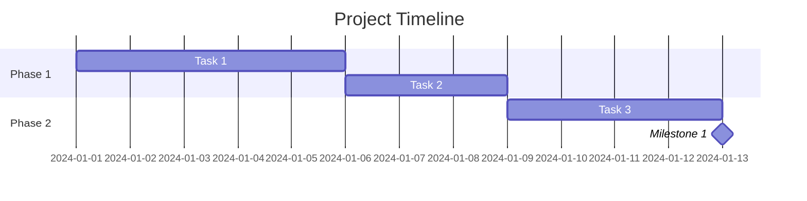

### Date Configuration

- **dateFormat**: Input date format (default: YYYY-MM-DD)
  - Supported formats: YYYY, YY, Q1-4, MM, MMM, MMMM, D, DD, Do, DDD, DDDD, X (Unix timestamp), x (Unix ms), H, HH, h, hh, m, mm, s, ss, S, SS, SSS, Z, ZZ

- **axisFormat**: Display format on timeline axis (default: %Y-%m-%d)
  - %Y: Year with century
  - %m: Month (01-12)
  - %d: Day of month (01-31)
  - %H: Hour (00-23)
  - %M: Minute (00-59)

Example:
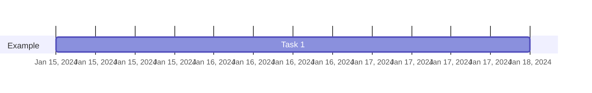

### Task Definitions

#### Basic Task
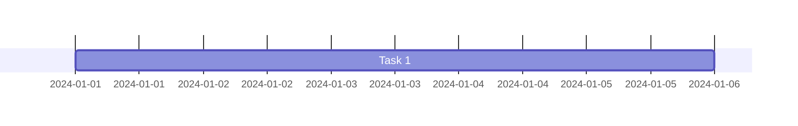

#### Task with ID


#### Sequential Tasks (Default)
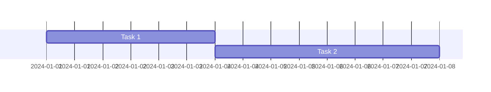

#### Multiple Dependencies
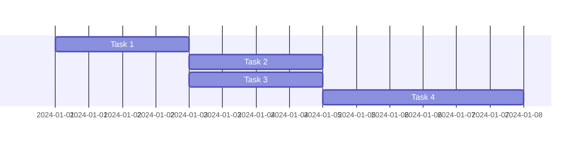

#### Specific Start Date
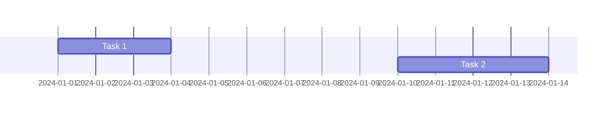

#### Until Another Task
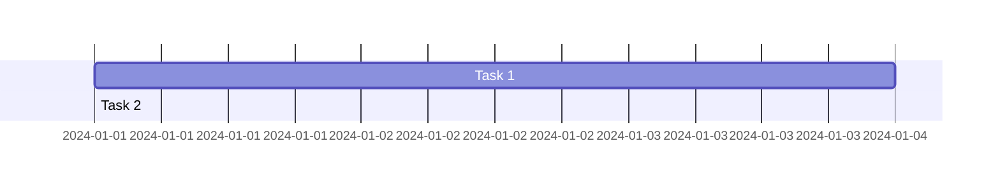

### Task Status Tags

#### Active Task
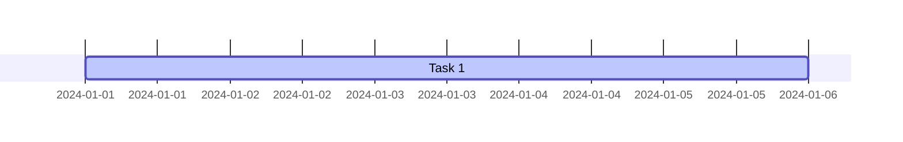

#### Completed Task
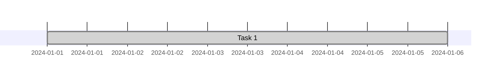

#### Critical Path
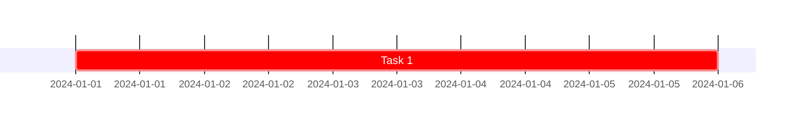

#### Milestone
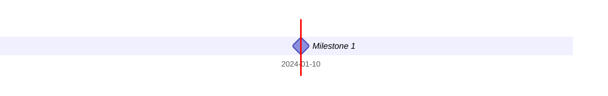

#### Combined Tags
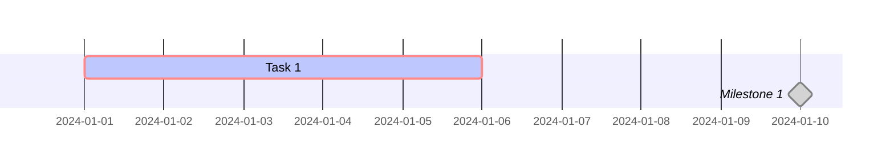

### Sections

Organize tasks into logical sections or phases:

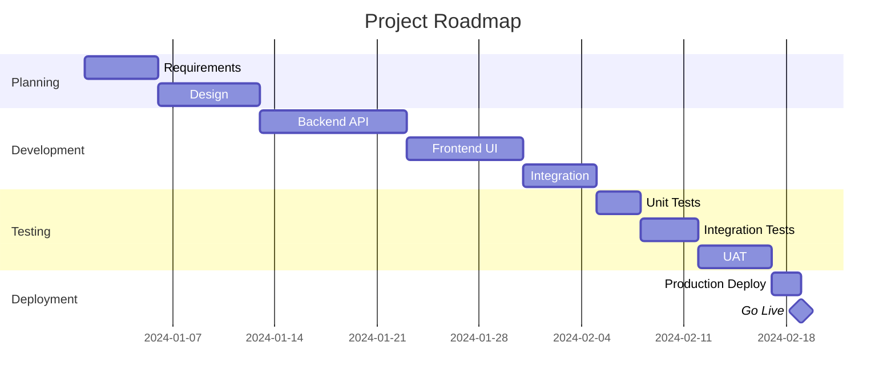

### Exclusions

Define non-working days or periods:

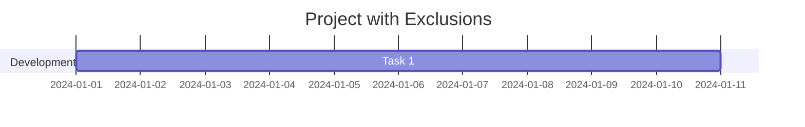

#### Exclude Weekends
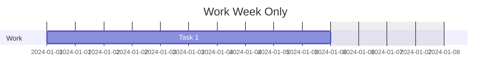

#### Define Weekend Days
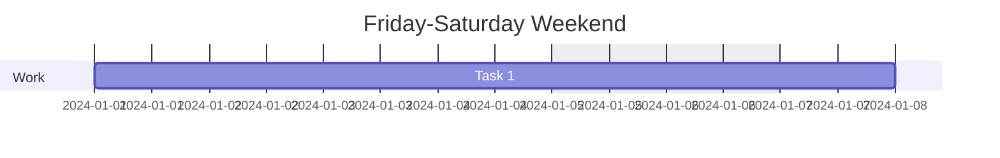

### Compact Mode

Display multiple tasks in same row:

```mermaid
gantt
    title Compact View
    dateFormat YYYY-MM-DD
    displayMode compact

    section Phase 1
    Task 1           :2024-01-01, 2d
    Task 2           :2024-01-03, 2d
    Task 3           :2024-01-05, 2d
```

### Vertical Markers

Add vertical lines for important dates:

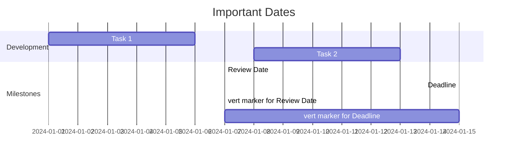

### Configuration Options

```javascript
mermaid.ganttConfig = {
  titleTopMargin: 25,        // Margin above title
  barHeight: 20,             // Height of task bars
  barGap: 4,                 // Gap between bars
  topPadding: 75,             // Padding below title
  rightPadding: 75,            // Padding for section names
  leftPadding: 75,             // Padding for section names
  gridLineStartPadding: 10,    // Vertical grid line position
  fontSize: 12,                // Font size
  sectionFontSize: 24,          // Section font size
  numberSectionStyles: 1,        // Alternating section styles
  axisFormat: '%Y-%m-%d',      // Axis date format
  tickInterval: '1week',        // Axis tick interval
  topAxis: true,               // Show dates on top
  displayMode: 'compact',       // Compact mode
  weekday: 'sunday'           // Week start day
};
```

---

## Timeline Syntax

Timeline for high-level project phases and milestones:

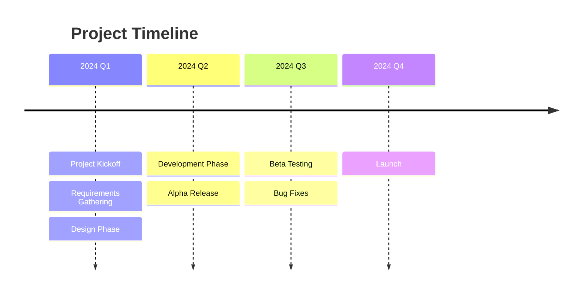

Detailed timeline:
```mermaid
timeline
    title Development Roadmap
    section Planning
      Jan 2024 : Kickoff Meeting
      Feb 2024 : Requirements Complete
      Mar 2024 : Design Signoff
    section Development
      Apr 2024 : Sprint 1
      May 2024 : Sprint 2
      Jun 2024 : Sprint 3
    section Testing
      Jul 2024 : Internal Testing
      Aug 2024 : User Acceptance Testing
    section Launch
      Sep 2024 : Production Deployment
```

---

## Common Mistakes to Avoid

### Gantt Chart Mistakes

**1. Missing unique task IDs**
   ❌ WRONG:
   ```mermaid
   gantt
       dateFormat YYYY-MM-DD
       Task 1 :2024-01-01, 3d
       Task 2 :after Task 1, 3d
   ```
   This won't work correctly - "after Task 1" doesn't reference an ID.

   ✅ CORRECT:
   ```mermaid
   gantt
       dateFormat YYYY-MM-DD
       Task 1 :t1, 2024-01-01, 3d
       Task 2 :t2, after t1, 3d
   ```

**2. Ambiguous or non-unique task names**
   ❌ WRONG: Multiple tasks named "API Task" or "Task 1"
   ✅ CORRECT: Descriptive, unique names with unique IDs

**3. Missing dependencies in single-developer projects**
   Without explicit `after` dependencies with unique IDs, parallel execution may be assumed, which is incorrect for one person.

---

## Best Practices for Project Plans

### Gantt Chart Guidelines

1. **Use clear, descriptive task names**
    - ✅ "Design User Authentication API"
    - ❌ "Auth API" or "Task 1"

2. **Break down large tasks**
    - Tasks should be 1-10 days each
    - If task is > 2 weeks, break it down

3. **Use milestones for key deliveries**
    - Zero-duration tasks (0d)
    - Mark phase completions, releases, reviews

4. **Show dependencies clearly**
    - Use `after taskID` for sequential work
    - Use multiple dependencies: `after task1 task2 task3`

5. **Use sections to organize**
    - Group by phase, team, or work stream
    - Makes chart easier to read

6. **Mark critical path**
    - Use `crit` tag for tasks on critical path
    - Helps identify schedule risks

7. **Track progress**
    - Use `active` for work in progress
    - Use `done` for completed work

8. **Always use unique task IDs**
    - Every task and milestone must have a unique ID
    - Required for proper dependency chains
    - Example: `taskID` pattern in task definitions
    - Without unique IDs, dependencies cannot be tracked accurately

9. **Ensure proper sequential execution**
    - Each task that depends on another must explicitly reference the previous task's ID
    - Use `:taskID, after previousTaskID` syntax
    - Critical for single-developer or constrained-resource projects

### Timeline Guidelines

1. **Keep it high-level**
    - Use for phases, milestones, releases
    - Don't include individual tasks

2. **Align with stakeholder communication**
    - External stakeholders: timeline view
    - Internal team: detailed Gantt

3. **Show key dates**
    - Launch dates, review milestones, decision points

---

## Project Plan Specific Considerations

### Gantt Charts for Project Plans

**Critical Issue: Unique Task IDs and Sequential Dependencies**

When creating Gantt charts for project plans (especially for single-developer or constrained-resource projects):

1. **Every task MUST have a unique ID**
   ```mermaid
   gantt
       dateFormat YYYY-MM-DD
       
       section Sprint 1
       Task 1 :t1, 2024-01-01, 3d
       Task 2 :t2, after t1, 3d
       Task 3 :t3, after t2, 4d
   ```
   Without unique IDs (like `:t1`, `:t2`), dependencies using `after` will not work correctly.

2. **Dependencies must reference previous task IDs**
   ```mermaid
   gantt
       dateFormat YYYY-MM-DD
       
       section Development
       Setup            :setup, 2024-01-01, 2d
       Backend API      :api, after setup, 5d
       Frontend UI      :ui, after setup, 4d
       Integration      :integ, after api ui, 3d
   ```
   Notice how `Integration` depends on both `api` and `ui` completing.

3. **Milestones should have IDs too**
   ```mermaid
   gantt
       dateFormat YYYY-MM-DD
       
       section Sprint 1
       Development      :dev, 2024-01-01, 10d
       Sprint Complete  :ms1, after dev, 0d
   ```

## ERD (Entity Relationship Diagram) Syntax

### Critical Updates (January 2026)

This section added to document lessons learned from creating Mermaid ERD diagrams for System Design Documents (SDDs).

### ERD Diagram Common Mistakes

#### 1. Using `enum` Keyword

❌ **WRONG:**
```mermaid
erDiagram
    Role {
        USER
        ASSISTANT
        ESCALATION_CONTEXT
    }
```

✅ **CORRECT:**
```mermaid
erDiagram
    Role {
        string value
        USER
        ASSISTANT
        ESCALATION_CONTEXT
    }
```

**Why**: Mermaid ERD does not support the `enum` keyword for defining value lists. Every entity definition must have at least one attribute.

**Fix**: Always add at least one attribute (e.g., `string value`) before listing enum values. Document the actual enum values in the entity definitions section below the ERD, not as part of the diagram itself.

#### 2. Empty Entities (No Attributes)

❌ **WRONG:**
```mermaid
erDiagram
    ClosureStatus {
        CLOSED
        OPEN
    }
```

✅ **CORRECT:**
```mermaid
erDiagram
    ClosureStatus {
        string value
        CLOSED
        OPEN
    }
```

**Why**: Mermaid ERD entities without attributes cause parse errors. Every entity must define at least one attribute.

**Fix**: Add a placeholder attribute like `string value` to all value-list entities.

#### 3. Referencing Enum Entity Names

❌ **WRONG:**
```mermaid
erDiagram
    ChatMessage {
        Role role
        string content
    }
```

**Where `Role` is defined as a separate enum entity above.**

✅ **CORRECT:**
```mermaid
erDiagram
    ChatMessage {
        string role
        string content
    }
```

**Why**: Referencing other enum entities from within attribute definitions causes issues.

**Fix**: Use basic types directly (e.g., `string role`, `string closureStatus`) in entity definitions. Document what values are allowed in the detailed entity definitions below the ERD.

---

## ERD Diagram Syntax

### Basic Structure

```mermaid
erDiagram
     EntityA ||--o{ EntityB : relationship_label
     EntityA {
         string attributeName PK
         string attributeName
     }
     EntityB {
         string attributeName FK
         string attributeName
     }
```

---

## Flowchart Syntax (for System Design Documents)

### Critical Updates (January 2026)

Added flowchart syntax guidance based on parsing errors encountered in Project Lumi System Design Document (SDD).

### Flowchart Common Mistakes

#### 1. Multi-Line Node Definitions

Mermaid parsers can fail when node labels span multiple lines without proper syntax.

**Example of broken syntax (from Project Lumi SDD):**
```mermaid
flowchart TB
  alb[AWS ALB
    - TLS termination
    - HTTP→HTTPS redirect
    - Health checks] --> app[Application]
```

**Solutions:**

**Option 1: Use single-line node labels with `<br/>` for line breaks:**
```mermaid
flowchart TB
  alb["AWS ALB<br/>- TLS termination<br/>- HTTP→HTTPS redirect<br/>- Health checks"] --> app[Application]
```

**Option 2: Use subgraphs for multi-node grouping:**
```mermaid
flowchart TB
  subgraph Infrastructure
    alb[AWS ALB]
    app[Application]
    db[(Database)]
  end

  alb --> app
  alb --> db
```

**Option 3: Use separate description nodes connected with dotted lines:**
```mermaid
flowchart TB
  alb[AWS ALB]
  features[Feature Notes:<br/>- item 1<br/>- item 2]
  alb -.-> features
```

#### 2. Node Labels with Special Characters

Node labels containing parentheses `()`, brackets `[]`, dashes `-`, or special characters can cause parse errors.

**Example of broken syntax:**
```mermaid
flowchart LR
  employee["Employee (Google Workspace user)"] -->|HTTPS| lumi["Lumi Web App"]
```

**Solution: Use double quotes around labels with special characters:**
```mermaid
flowchart LR
  employee["Employee (Google Workspace user)"] -->|HTTPS| lumi["Lumi Web App"]
```

**Best Practice:** Always use `["Node Label"]` when label contains:
- Parentheses `()`
- Brackets `[]`
- Special characters like `-`, `*`, `/`
- Multi-line text

#### 3. Arrow Labels with Dashes or Asterisks

**Example of broken syntax (from Project Lumi SDD):**
```mermaid
flowchart LR
  alb[AWS ALB<br/>- HTTPS Termination<br/>- HTTP→HTTPS Redirect<br/>- DDoS (AWS Shield)<br/>- WAF (Bot Protection)<br/>- Health Checks]
```

**Solution: Use text for labels, avoid special characters in feature lists:**
```mermaid
flowchart LR
  alb[AWS ALB<br/>HTTPS Termination<br/>HTTP to HTTPS Redirect<br/>DDoS AWS Shield<br/>WAF Bot Protection<br/>Health Checks]
```

**Best Practice:** Keep node labels simple. Move detailed descriptions to surrounding text in the document section.

#### 1. Multi-Line Node Definitions

Mermaid parsers can fail when node labels span multiple lines without proper syntax.

**Example of broken syntax:**
```mermaid
flowchart TB
  alb[AWS ALB
    - TLS termination
    - HTTP→HTTPS redirect
    - Health checks] --> app[Application]
```

**Solutions:**

**Option 1: Use single-line node labels with `<br/>` for line breaks:**
```mermaid
flowchart TB
  alb["AWS ALB<br/>- TLS termination<br/>- HTTP→HTTPS redirect<br/>- Health checks"] --> app[Application]
```

**Option 2: Use subgraphs for multi-node grouping:**
```mermaid
flowchart TB
  subgraph Infrastructure
    alb[AWS ALB]
    app[Application]
    db[(Database)]
  end

  app --> db
  alb --> app
```

**Option 3: Use separate description nodes connected with dotted lines:**
```mermaid
flowchart TB
  alb[AWS ALB]
  features[Feature Notes:<br/>- TLS termination<br/>- HTTP→HTTPS redirect<br/>- Health checks]
  alb -.-> features
```

#### 2. Node Labels with Special Characters

Node labels containing parentheses `()`, brackets `[]`, or other special characters can cause parse errors.

**Example of broken syntax:**
```mermaid
flowchart LR
  employee[Employee (Google Workspace user)] -->|HTTPS| lumi[Lumi Web App]
```

**Solution: Use double quotes around labels with special characters:**
```mermaid
flowchart LR
  employee["Employee (Google Workspace user)"] -->|HTTPS| lumi["Lumi Web App"]
```

**Best Practice:** Always use `["Node Label"]` when label contains:
- Parentheses `()`
- Brackets `[]`
- Special characters like `@`, `#`, `*`
- Multi-line text

#### 3. Arrow Labels with Special Characters

Arrow labels with special syntax can also cause issues.

**Example:**
```mermaid
flowchart LR
  A -->|Feature list:<br/>- item 1<br/>- item 2| B
```

**Solution:** Use quotes for arrow labels too:
```mermaid
flowchart LR
  A -->|"Feature list:<br/>- item 1<br/>- item 2"| B
```

### Flowchart Best Practices

1. **Use quotes for complex labels:** `["Complex (Label) with Special Chars"]`
2. **Use `<br/>` for multi-line text:** `"Line 1<br/>Line 2<br/>Line 3"`
3. **Avoid actual line breaks in node definitions:** Everything between `[` and `]` should be on one logical line
4. **Test diagrams locally:** Use mermaid live editor (https://mermaid.live) to validate complex diagrams
5. **Keep nodes focused:** Single responsibility per node makes diagrams clearer and less error-prone

### Relationship Cardinality

- `||--||` = One-to-One (1:1)
- `||--o{` = One-to-Many (1:N)
- `}o--||` = Many-to-One (N:1)
- `}o--o{` = Many-to-Many (N:M)
- `||--o|` = One-to-Zero-or-One (1:0..1)

### Attribute Syntax

- `string attributeName` = String type
- `integer attributeName` = Integer type
- `timestamp attributeName` = Timestamp type
- `boolean attributeName` = Boolean type
- `list~Type~ attributeName` = List of Type
- `PK` = Primary key (append to attribute name)
- `FK` = Foreign key (append to attribute name)
- `UK` = Unique key (append to attribute name)

---

## ERD Diagram Best Practices

### 1. Document Enums Separately

For value lists/enums (Role, ClosureStatus, etc.):

**In ERD Diagram:**
- Define entity with at least one attribute
- Use basic type (e.g., `string role`)
- Do NOT use `enum` keyword

**In Entity Definitions Section:**
- Document allowed values
- Explain what each value means
- Provide examples

### 2. Keep ERD Focused on Relationships

The ERD diagram should focus on:
- Entity relationships (cardinality, direction)
- Key attributes (PK, FK, important types)
- Clear, readable structure

Avoid:
- Too many attributes in ERD (save detailed attributes for entity definitions section)
- Complex constraints (these go in implementation or entity definitions)
- Enum definitions in ERD (document below)

### 3. Validate Before Documenting

Before saving, check:

1. **No `enum` keyword** in ERD definitions
2. **Every entity has at least one attribute** (even value lists)
3. **Basic types used** instead of enum entity references
4. **Relationships use correct cardinality syntax**
5. **Entities are properly connected** (no orphan entities)

### 4. Use Entity Definitions Section

The ERD diagram shows relationships. The entity definitions section explains:

- **Purpose**: Why this entity exists
- **Why This Entity Exists**: Rationale
- **Responsibilities**: What data it captures
- **Key Attributes**: Domain-level attributes
- **Invariants/Constraints**: Business rules
- **Lifecycle**: How entity changes over time
- **Rationale**: Design rationale

For enums, document the allowed values in the entity definitions section, not in the ERD.

---

## Common Project Management Visualizations

### Release Planning
```mermaid
gantt
    title Release Roadmap 2024
    dateFormat YYYY-MM-DD
    axisFormat %b %Y

    section Q1
    v1.0 Release        :milestone, 2024-03-31, 0d
    Core Features        :2024-01-15, 60d

    section Q2
    v1.1 Release        :milestone, 2024-06-30, 0d
    Enhancements         :2024-04-15, 60d

    section Q3
    v2.0 Release        :milestone, 2024-09-30, 0d
    Major Update         :2024-07-15, 60d
```

### Sprint Tracking
```mermaid
gantt
    title Sprint 3
    dateFormat YYYY-MM-DD
    excludes weekends

    section Backend
    API Integration    :api, 2024-01-15, 3d
    Data Migration     :data, after api, 2d

    section Frontend
    UI Components      :ui, 2024-01-15, 4d
    User Stories       :stories, after ui, 3d

    section QA
    Testing           :qa, after data stories, 2d
    Bug Fixes         :bugs, after qa, 1d

    section Milestone
    Sprint End        :end, after bugs, 0d
```

### Cross-Team Coordination
```mermaid
gantt
    title Cross-Team Dependencies
    dateFormat YYYY-MM-DD

    section Backend Team
    Service API       :back1, 2024-01-01, 7d
    Database Schema    :back2, 2024-01-05, 5d

    section Frontend Team
    UI Wireframes     :front1, 2024-01-01, 5d
    Component Dev      :front2, after front1, 7d

    section DevOps Team
    CI/CD Pipeline    :ops1, 2024-01-03, 4d
    Deployment Prep    :ops2, 2024-01-10, 3d

    section Integration
    API Integration   :int1, after back1 front2, 5d
    E2E Testing       :int2, after int1 ops2, 3d
```

### Risk Timeline
```mermaid
gantt
    title Risk Mitigation Timeline
    dateFormat YYYY-MM-DD

    section Critical Risks
    Performance Issue   :crit, perf, 2024-01-01, 10d
    Security Audit     :crit, sec, 2024-01-05, 7d

    section Mitigation
    Cache Layer        :cache, after perf, 5d
    Security Fixes     :fix, after sec, 3d

    section Validation
    Load Testing       :load, after cache, 3d
    Penetration Test   :pentest, after fix, 3d
```
